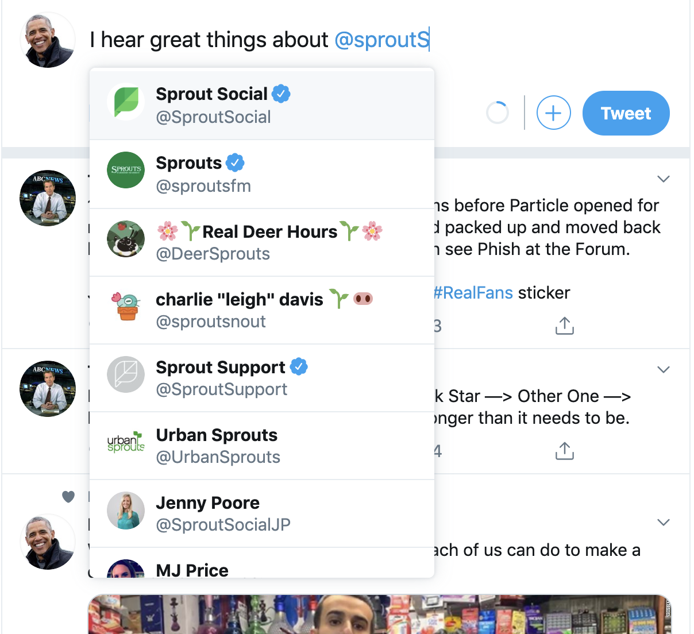

# Sprout Social Applicant Homework

## Environment Dependencies:

1. **Node v10.12.0**:
   - This project was set up using node v10.12.0. You should use the same version of node in order to avoid environment issues.
   - Node can be downloaded and installed from https://nodejs.org/en/
   - Different node versions can be installed and used on a machine via Node Version Manager (nvm)
     - Install nvm: https://github.com/creationix/nvm#install-script
     - Once installed, simply run `nvm use` while in the project. This will use the version of node specified in the `.nvmrc` file.
     - Additional download/installation of the node version may be required -- nvm will provide installation instructions if necessary.
2. **Yarn Package Manager**
   - Because create-react-app uses yarn to manage dependencies (instead of npm), new dependencies should be added using `yarn add`.
   - Installing Yarn: https://yarnpkg.com/lang/en/docs/install/
   - To install packages, use `yarn add package`. It's the equivalent of `npm install package` with npm.
   - To learn about other yarn commands, see https://yarnpkg.com/lang/en/docs/migrating-from-npm/#toc-cli-commands-comparison for more info.

## Getting Started

- To install dependencies run `yarn`
- To run the web app and api server together, run `npm run dev`
- To run the web app separately, run `npm run start`
  - This may take a minute or 2 to run
- To run api server separately, (in another terminal) run `npm run server`

## Twitter-Screenname-Server API

- Run the twitter-screenname-server by running `npm run server`
- The server should be running on `http://localhost:4000`
- Navigating to `http://localhost:4000/twitter/user/search?username=chicago` should return a large JSON response.
- To use the api, you can make a request directly to `http://localhost:4000`.
- If port 4000 is in use, feel free to update /twitter-screenname-server/server.js source code to use a different port.

## Create-React-App

- Create-react-app was used to set up the build process for this project. You do not need to read through the readme to work in this project.
- The README generated by create-react-app was moved to `README-create-react-app.md`.
- To keep the project simple and avoid any unexpected caching, the Service Worker was removed from the project.

## My thoughts ( In Retrospect )
**First off, Thank you!**
I really do appreciate the opportunity, and you can see by my effort that I'm really excited at the chance to join Sprout Social.  I actually had a lot of fun working with hooks, which I had not before.

**state**:  In hindsight, I very much regret not using a state management system.  Redux is my goto, but I think using a combination of  `useContext` and a `useReducer` would suffice and make things far easier to reason about.  There is only one or two workarounds that really stick out to me, but I could see needing to refactor this pretty quickly.  I think it would only take a day.

**styles**:   In terms of css,  I kind of just "got the job done" on this one.  I was not very methodical and if I had more time, I would have been. 

**a11y**:  I'm bummed about not getting to the a11y attributes. If this were an actual product feature I would have made this a top priority and part of normal workflow, but it's just a blindspot for me.

**design**:  I'm attaching a screenshot of the current Twitter interface because this is what I modeled after.

